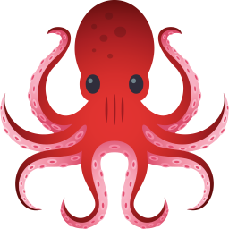

### Hi all, I'm Yauhen Naliotau, beginner front-end developer 👋

#### About me
Dedicated, result-oriented, over 13 years in finance. An open-minded, motivated, adequate and honest person that likes learning and using new languages and tech stacks. Try and figure out how to improve the bad things and take the good things on board for any future ventures. I'm always open to new approaches and look out for any tips and tricks I can apply to my own work.

#### How to reach me:

#### Tech Stack:

  
  
  
  
  
  
  
  
  
  
  
  
  
  
  

<!--
**Disembow/Disembow** is a ✨ _special_ ✨ repository because its `README.md` (this file) appears on your GitHub profile.

Here are some ideas to get you started:

- 🔭 I’m currently working on ...
- 🌱 I’m currently learning ...
- 👯 I’m looking to collaborate on ...
- 🤔 I’m looking for help with ...
- 💬 Ask me about ...
- 📫 How to reach me: ...
- 😄 Pronouns: ...
- ⚡ Fun fact: ...
-->
